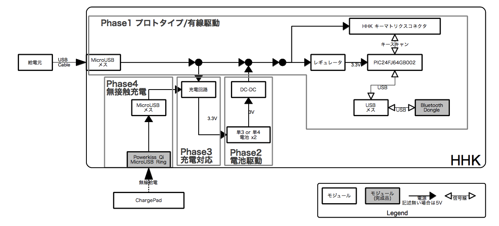

## 検討方針

### 要件

1. BluetoothでPCに接続して使えること
2. 電池で駆動できること
3. 電池を取り外さずに充電できること
4. 電池を取り外さずに無接触で充電できること

### 方針

以下のように段階を追って検討してみようと思っています。

1. Phase1 プロトタイプ検討/有線で外部から給電
 * プロトタイプ検討はブレッドボードなどで行います。その際には特に電池駆動などはせずに有線で給電し、制御検討を行います。
 * 有線給電のまま、HHK本体に組込み込みを行い、メカ的な問題をクリアにします。
2. Phase2 電池で駆動
 * DC-DCコンバータと電池BOXを内蔵し、スタンドアロンで使えるようにします
3. Phase3 電池を取り外さずに充電
 * 充電回路を組込み、電池を外さずに充電できるようにします。
4. Phase4 無接触給電
 * Qi対応の給電機器を用いて、無接触で充電できるようにします。

